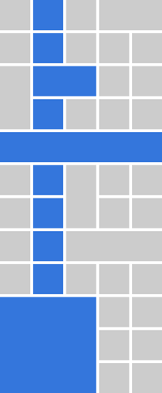

# Wholly

jQuery plugin for triggering table column `mouseenter` and `mouseleave` events. Wholly is used for highlighting the entire table column. Wholly supports tables with `colspan` and `rowspan` attributes.

[Interactive demo](http://gajus.com/wholly/demo/).

## How it works?

If you want to support `colspan` and `rowspan`, then first you need to build table cell index, ie. matrix that identifies cell positition in every row regardless of the markup. Then you need to track events of all the table cells of interest and calculate their offset in the matrix and the columns that share the vertical index.

The resulting lookup is illustrated in the following animation:



## Use case

Most often you'd use Wholly to highlight the entire column of the selected cell.


However, Wholly is not limited to setting a particular style. The custom event hooks allows you to select the entire column and can be used to copy the data, for selecting multiple columns, etc.

## Usage

Instantiating wholly will add two new events `wholly.mouseenter` and `wholly.mouseleave` that you can use to customise table behaviour. In the below example, Wholly is used for highlighting the entire table column.

There are no additional settings.

```js
$(function () {
    var table = $('table');

    table.wholly();

    table.on('wholly.mouseenter', 'td, th', function () {
        $(this).addClass('wholly-highlight');
    });

    table.on('wholly.mouseleave', 'td, th', function () {
        $(this).removeClass('wholly-highlight');
    });
});
```