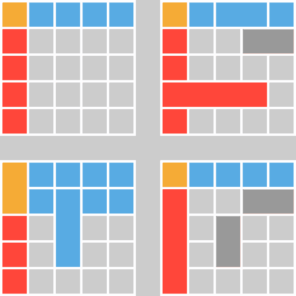

# Wholly

[](https://travis-ci.org/gajus/wholly)
[](http://badge.fury.io/bo/wholly)
[](https://twitter.com/intent/tweet?text=Hightlight%20the%20entire%20active%20table%20row%20and%20column%20using%20Wholly,%20%23JavaScript%20%23jQuery%20plugin&url=https://github.com/gajus/wholly&via=kuizinas)

jQuery plugin used to select the entire table row and column in response to `mouseenter` and `mouseleave` events. Wholly supports table layouts that utilize `colspan` and `rowspan`.

[Interactive demo](http://gajus.com/sandbox/wholly/demo/).

## How does it work?

If you want to support `colspan` and `rowspan`, then first you need to build table index, ie. matrix that identifies cell position in every row regardless of the markup. Then you need to track events of all the table cells and calculate their offset in the matrix and the columns that share the horizontal and vertical index.

The resulting lookup is illustrated in the following animation:



## Why not CSS?

There are at least a few ways to achieve column highlighting using just CSS or with little JavaScript, e.g.

* http://stackoverflow.com/a/11175979/368691, CSS only solution using pseudo elements.
* http://www.cssnewbie.com/simple-table-column-highlighting/#.U1Ywa1GSwe4, JavaScript together with [HTML table column element](https://developer.mozilla.org/en-US/docs/Web/HTML/Element/col).

Neither of the above solutions support `rowspan` or `colspan`. In essence, neither of the above will work if you have header groups, merged columns or a summarizing table footer. Wholly supports `colspan` and `rowspan` anywhere in the `<table>`.

## Use case

Most often you'd use Wholly to highlight the entire column of the selected cell.


Wholly is not limited to setting a particular style. The custom event hooks allow you to select the entire row and column and can be used to copy the data, for selecting multiple columns, etc.

## Usage

There are two options that automate highlighting:

```js
$('table').wholly({
    highlightHorizontal: 'horizontal-class-name',
    highlightVertical: 'vertical-class-name'
});
```

The following events are available:

| Event Name | Description |
| --- | --- |
| `wholly.mouseenter-horizontal` | Fired on the individual table cells. |
| `wholly.mouseleave-horizontal` | Fired on the individual table cells. |
| `wholly.mouseenter-vertical` | Fired on the individual table cells. |
| `wholly.mouseleave-vertical` | Fired on the individual table cells. |
| `wholly.mouseenter` | Fired on the whole table. |
| `wholly.mouseleave` | Fired on the whole table. |

To get the affected cells, use the the above events as such:

```js
$('table').on('wholly.mouseenter-horizontal wholly.mouseleave-horizontal mouseenter-vertical mouseleave-vertical', function (e) {
    // e.target
});

$('table').on('wholly.mouseenter wholly.mouseleave', function (e, affectedAxes) {
    // affectedAxes.horizontal
    // affectedAxes.vertical
});
```
